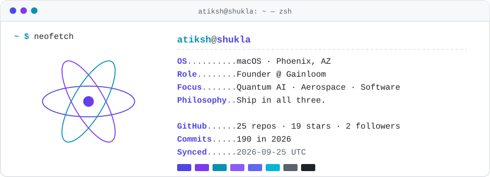
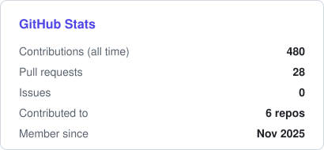
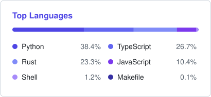
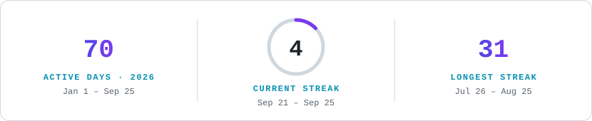

<picture>
  <source media="(prefers-color-scheme: dark)" srcset="assets/header-dark.svg">
  
</picture>

  
  
  
  

<picture>
  <source media="(prefers-color-scheme: dark)" srcset="assets/neofetch-dark.svg">
  
</picture>

## About

I move between quantum research, flight systems, and production software — and I ship in all three. The through-line is taking hard theory, from combinatorial optimization to orbital dynamics, and turning it into tools people actually run.

- **Quantum AI Researcher** — optimization algorithms for large-scale combinatorial problems
- **Aerospace Systems Engineer** — modeling, simulation, flight-systems tooling
- **Full-Stack Developer** — typed APIs, React frontends, cloud deployment
- **Content Creator** — [LifeAndBooks](#lifeandbooks)

## Featured projects

<table>
<tr>
<td width="50%" valign="top">
<b>Walkthru</b> · 1st Place, NY Tech Week Intern Hackathon 2026 (Mantle / YC F25) 
Pre-commit LLM quiz gate — forces you to understand code before it ships. 
<code>Git Hooks</code> <code>LLMs</code>
</td>
<td width="50%" valign="top">
<b><a href="https://github.com/ats4321/dextrivia">Dextrivia</a></b> 
Orbital debris removal optimizer using a TSP variant formulated as QUBO. 
<code>Python</code> <code>SGP4</code> <code>Celestrak TLE</code>
</td>
</tr>
<tr>
<td width="50%" valign="top">
<b><a href="https://github.com/ats4321/prism">Prism</a></b> 
Self-hosted AI code reviewer for GitHub PRs — no SaaS dependency. 
<code>Python</code> <code>Ollama</code> <code>GitHub Webhooks</code>
</td>
<td width="50%" valign="top">
<b><a href="https://github.com/ats4321/the-last-alibi">The Last Alibi</a></b> 
AI-generated murder mystery game with dynamic storytelling. 
<code>Next.js</code> <code>TypeScript</code> <code>OpenAI</code> <code>Zustand</code>
</td>
</tr>
<tr>
<td width="50%" valign="top">
<b><a href="https://github.com/ats4321/ragit">Ragit</a></b> 
Local-first RAG CLI for private document Q&amp;A. 
<code>Python</code> <code>Ollama</code> <code>Local Embeddings</code>
</td>
<td width="50%" valign="top">
<b>Orphy</b> 
Real-time ambient AI vocal coach. 
<code>Gemini API</code> <code>Next.js</code> <code>LangChain</code> <code>Pinecone</code>
</td>
</tr>
</table>

## Tech stack

  <b>LANGUAGES</b> 
  <picture>
    <source media="(prefers-color-scheme: dark)" srcset="https://skillicons.dev/icons?i=py,ts,js,cpp&theme=dark">
    
  </picture>

  <b>AI &amp; ML</b> 
  <picture>
    <source media="(prefers-color-scheme: dark)" srcset="assets/stack-ai-dark.svg">
    
  </picture>

  <b>WEB</b> 
  <picture>
    <source media="(prefers-color-scheme: dark)" srcset="https://skillicons.dev/icons?i=nextjs,react,nodejs,tailwind&theme=dark">
    
  </picture>

  <b>SPECIALIZED</b> 
  <picture>
    <source media="(prefers-color-scheme: dark)" srcset="assets/stack-special-dark.svg">
    
  </picture>

## GitHub stats

  <picture>
    <source media="(prefers-color-scheme: dark)" srcset="assets/stats-dark.svg">
    
  </picture>
  <picture>
    <source media="(prefers-color-scheme: dark)" srcset="assets/langs-dark.svg">
    
  </picture>
  <picture>
    <source media="(prefers-color-scheme: dark)" srcset="assets/streak-dark.svg">
    
  </picture>
  <picture>
    <source media="(prefers-color-scheme: dark)" srcset="assets/snake-dark.svg">
    
  </picture>

## LifeAndBooks

<picture>
  <source media="(prefers-color-scheme: dark)" srcset="assets/youtube-dark.svg">
  
</picture>

Books, productivity, and the examined life — built from zero with a data-driven content strategy.

## Connect

Open to **research collaborations**, **speaking**, **open-source contributions**, and **building ambitious things together** — reach me through the links at the top.

Speaking topics: Quantum Optimization · AI Systems & Agents · Aerospace Engineering · Content Strategy

Cards regenerate daily from the GitHub API by <a href=".github/workflows/update-stats.yml">this workflow</a>.

