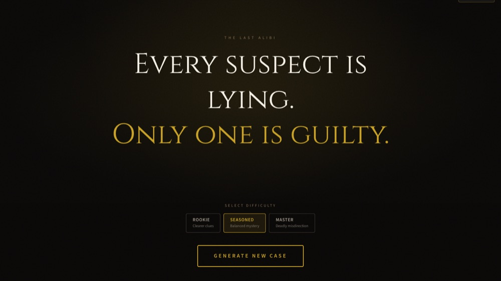

TODO(atiksh): Walkthru demo GIF or a photo you took goes here.

# Atiksh Shukla

Hi, I'm Atiksh. I'm in Phoenix, and most of what I build is AI tooling wrapped in a full-stack app someone can actually use.

## Now

I'm building [Gainloom](TODO-atiksh-gainloom-url). TODO(atiksh): one sentence on what Gainloom is and who it's for. With my mom, I also run [LifeAndBooks](https://youtube.com/@LifeandBooksss), a YouTube channel about books and life that has grown to 30K+ subscribers, 215+ videos, and 217K+ views.

## Projects

**[Walkthru](https://github.com/andrewzagula/Walkthru)**: A pre-commit check that quizzes you on your own diff before the commit goes in. Won first place at the NY Tech Week Intern Hackathon 2026 (Mantle, YC F25). Git hooks, LLMs.

How it works

It hooks into git, intercepts each commit, and asks you about your own diff with multiple choice, matching, and free-response questions. Score below 3.0 out of 5 and the commit is blocked. AI can write code faster than you can understand it, so something should check.

**[Prism](https://github.com/ats4321/prism)**: Self-hosted AI code reviewer for GitHub PRs, with no SaaS dependency. Python, Ollama, GitHub webhooks.

How it works

A webhook server pulls the diff on every PR event, splits it into hunks, reviews them with a local Ollama model, and posts inline comments on the exact file and line. When there's nothing worth saying, it deliberately says nothing. No code leaves the machine.

**[Ragit](https://github.com/ats4321/ragit)**: Local-first RAG CLI for asking questions about private documents. Python, Ollama, local embeddings.

How it works

It's two commands: `ragit index ./docs`, then `ragit chat ./docs`. Embeddings and generation both run through Ollama on your own machine, so there are no API keys and no cloud services.

**[The Last Alibi](https://github.com/ats4321/the-last-alibi)**: AI-generated murder mystery game where every case is new. Next.js, TypeScript, OpenAI, Zustand.

How it works

Each case is generated from scratch: victim, suspects, motives, timeline, and a hidden killer. You interrogate suspects in chat, and the killer lies while the innocent ones don't. An evidence corkboard tracks contradictions, and the AI judges your final accusation.

**[Dextrivia](https://github.com/ats4321/dextrivia)**: Orbital debris removal optimizer using a TSP variant formulated as QUBO. Python, SGP4, Celestrak TLE.

How it works

It pulls live TLE data from Celestrak, propagates every object to a common epoch with SGP4, and builds a delta-v cost matrix from Hohmann transfers between each pair. A greedy solver then sequences a removal order for the Iridium-Cosmos 2009 debris cloud, which is the baseline a QUBO solver has to beat.

**Orphy** (TODO(atiksh): repo or demo link): Real-time ambient AI vocal coach. Gemini API, Next.js, LangChain, Pinecone, SendBlue.

How it works

It listens while you sing or speak, analyzes pitch and delivery, and coaches you in the moment instead of after the fact. I built it end to end at a multimodal hackathon.

TODO(atiksh): Orphy screenshot, if you have one.

More detail on each project is on [my site](https://atikshshukla.vercel.app).

## Latest from LifeAndBooks

<!-- BLOG-POST-LIST:START -->
- [Practical Wisdom with Ancient Scriptures: Bhagavad Gita Chapter 9 Verse 27 | Episode 217](https://www.youtube.com/watch?v=W4T5xo0Y3KM)
- [Doha Diaries, Essence of Life: The Priceless Things We Often Take for Granted | Episode 216](https://www.youtube.com/watch?v=8c5MtFFhLQs)
- [Quote that Stayed with me: What You Seek May Not Be What You Expect | Episode 215](https://www.youtube.com/watch?v=w1m9q2F5tYY)<!-- BLOG-POST-LIST:END -->

## Lately

- Reading: TODO(atiksh)
- Learning: TODO(atiksh)
- Away from the keyboard: TODO(atiksh)

I mostly write Python and TypeScript, usually with Next.js, React, and LangChain.

[Portfolio](https://atikshshukla.vercel.app) · [LinkedIn](https://linkedin.com/in/atiksh-shukla-a63356390) · [X](https://x.com/atshuu21) · [YouTube](https://youtube.com/@LifeandBooksss) · [Email](mailto:theatikshshukla@gmail.com)
